# Livrable 2: Domaine

SEG 3502 - ARCHITECT. & CONCEPT. LOGICIEL

Automne 2026

École de Génie Électrique et Science Informatique
Université d’Ottawa
Professeur: Kalonji Kalala

**CAR-HMS**
Par uOCode-10

Étudiant 1: Robichaud, Tristan (300391286, toxoscorp)
Étudiant 2: Dufresne, Sebastien (300364803, SB2DD)

## Sommaire exécutif

Ce document présente l’implémentation du domaine CAR-HMS à l’intention de l’équipe, des mainteneurs et de l’évaluateur. Il décrit les hypothèses, les agrégats, les réalisations des neuf cas d’utilisation et leur vérification par contrats Cucumber exécutables.

## Description de l'équipe et des rôles

Les rôles sont les suivants :
- Tristan Robichaud | Code Kotlin | 50% 
- Sebastien Dufresne | Rapport | 50%

## Hypothèses

-	Les exigences utilisent deux échelles différentes pour décrire l'habileté des randonneurs et la difficulté des sentiers. Nous faisons donc correspondre débutant à facile, intermédiaire à modéré, avancé à difficile et expert à très difficile. Pour résoudre la différence de formulation entre le glossaire et le résumé du cas d'utilisation, un randonneur peut s'inscrire à toute randonnée de difficulté inférieure ou égale à son niveau augmenté d'un échelon. Un expert peut donc participer à une randonnée facile.
-	La distribution des invitations est hors portée du système, mais leur validation est nécessaire à l'enregistrement. Nous supposons donc que les codes sont fournis par un processus externe, sans ajouter de fonction pour les créer ou les distribuer. Chaque code est à usage unique, sans expiration et sans rattachement préalable à un courriel. Le système vérifie séparément l'unicité du courriel normalisé. Un code n'est consommé que si l'enregistrement réussit entièrement: une erreur de formulaire ou un courriel déjà utilisé ne doit pas rendre l'invitation inutilisable.
-	Le glossaire décrit une randonnée "terminée", alors que les exigences fonctionnelles ne demandent d'enregistrer que les statuts ouverte, complète, fermée et annulée. Nous conservons ces quatre statuts et calculons le caractère terminé lorsqu'une randonnée non annulée appartient à une date locale passée. Il n'y a donc pas de commande ni d'événement supplémentaire pour la terminer. Chaque transition enregistrée conserve le statut, l'instant, l'acteur et, pour une annulation, le motif. Une fermeture automatique est attribuée à SYSTEM, tandis qu'un passage à complète ou une réouverture est attribué à l'utilisateur dont l'action l'a provoqué.
-	Toutes les règles calendaires sont interprétées dans le fuseau d'Ottawa, America/Toronto. À la création, le champ date fournit la date locale et startTime l'heure locale. Les autres échéances représentent des instants et les durées sont exprimées en minutes. Les changements d'heure suivent la résolution standard de java.time. Pour départager les formulations "échéance passée" et "échéance atteinte", les inscriptions et leurs annulations deviennent interdites dès l'instant exact de l'échéance, même si la fermeture automatique n'a pas encore été exécutée. L'échéance doit être future, strictement antérieure au départ et ne pas précéder sa date locale de plus de 14 jours civils.
-	Nous considérons que la capacité, toujours strictement positive, désigne les places offertes aux participants et exclut l'organisateur. Une randonnée complète accepte encore des demandes avant l'échéance, mais les nouvelles inscriptions sont placées en attente. La consultation publique reste limitée aux randonnées ouvertes, conformément au résumé fourni. La priorité dépend de l'instant d'inscription, puis de l'ordre d'insertion dans le dépôt si deux instants sont identiques. Un randonneur ne peut avoir qu'une inscription active à la même randonnée. Après annulation, il peut se réinscrire, mais obtient une nouvelle inscription et perd son ancienne priorité ; l'inscription annulée est conservée.
-	L'âge est évalué à la date d'enregistrement. Avant 18 ans, l'acceptation du tuteur remplace celle du mineur et son nom doit être consigné. Dès le 18e anniversaire, l'acceptation personnelle suffit. Une correction ultérieure de la naissance est refusée si elle rendrait la décharge initiale invalide faute de tuteur, car l'interface de mise à jour ne permet pas d'en recueillir une nouvelle. Pour les organisateurs, les dates de délivrance et d'expiration d'une certification sont inclusives. La certification doit être valide lors de son enregistrement et couvrir la date de toute randonnée créée. Une adhésion active est également requise pour créer une randonnée.
-	Le club ne gère pas son propre catalogue de sentiers: le dépôt fournit des instantanés en lecture des données CCN, éventuellement disponibles en cache. Si les données nécessaires sont absentes, l'opération est refusée plutôt que de supposer le sentier valide. Comme les limites exactes des saisons ne sont pas définies dans les exigences, nous attendons des bornes calendaires explicites du fournisseur plutôt que d'inventer des dates d'été et d'hiver. Une saison sans bornes représente une ouverture annuelle. Les tests fournissent des données annuelles ou des bornes explicites. L'import et l'actualisation relèvent du futur adaptateur.
-	Un rappel vise les inscriptions confirmées d'une randonnée prévue le lendemain civil, et non exactement 24 heures plus tard. L'absence de météo n'empêche pas son envoi: seul l'avertissement est omis, comme le prévoit le cas d'utilisation. Si le courriel échoue, l'opération métier demeure enregistrée et la notification passe à FAILED, avec un événement d'échec. Les détails techniques de l'erreur ne sont pas conservés afin d'éviter de divulguer des secrets. Lors d'une relance séquentielle, un rappel déjà envoyé n'est pas renvoyé: Un rappel en échec peut être réessayé. Cette règle ne garantit pas une livraison exactement une fois après un crash ou lors de traitements simultanés.
-	Le système ne suit pas la présence physique aux randonnées. Nous interprétons donc le nombre de participants du futur rapport comme le nombre d'inscriptions confirmées aux randonnées non annulées, et non comme un décompte des présences réelles. Les bornes de période sont inclusives et portent sur les dates de départ. Le nombre total de randonnées inclut celles annulées, qui sont aussi comptées séparément. Cette interprétation prépare le modèle, mais l'implémentation du cas de rapport reste exclue du présent livrable.

## Modèle du domaine

### Randonneurs et organisateurs

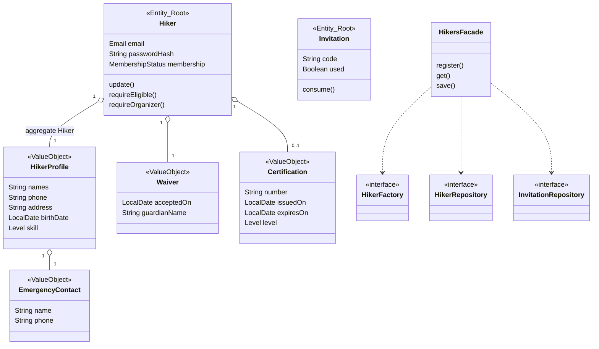
```mermaid
classDiagram
    class Hiker {
        <<Entity_Root>>
        Email email
        String passwordHash
        MembershipStatus membership
        update()
        requireEligible()
        requireOrganizer()
    }
    class HikerProfile {
        <<ValueObject>>
        String names
        String phone
        String address
        LocalDate birthDate
        Level skill
    }
    class EmergencyContact {
        <<ValueObject>>
        String name
        String phone
    }
    class Waiver {
        <<ValueObject>>
        LocalDate acceptedOn
        String guardianName
    }
    class Certification {
        <<ValueObject>>
        String number
        LocalDate issuedOn
        LocalDate expiresOn
        Level level
    }
    class Invitation {
        <<Entity_Root>>
        String code
        Boolean used
        consume()
    }
    class HikersFacade {
        register()
        get()
        save()
    }
    class HikerFactory { <<interface>> }
    class HikerRepository { <<interface>> }
    class InvitationRepository { <<interface>> }
    Hiker "1" o-- "1" HikerProfile : aggregate Hiker
    HikerProfile "1" o-- "1" EmergencyContact
    Hiker "1" o-- "1" Waiver
    Hiker "1" o-- "0..1" Certification
    HikersFacade ..> HikerFactory
    HikersFacade ..> HikerRepository
    HikersFacade ..> InvitationRepository
```

### Randonnées

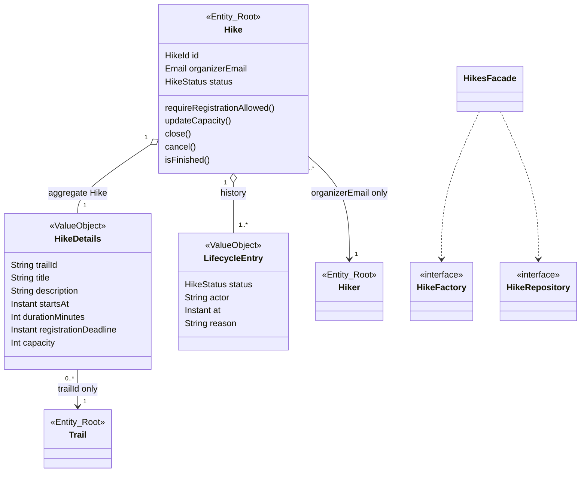
```mermaid
classDiagram
    class Hike {
        <<Entity_Root>>
        HikeId id
        Email organizerEmail
        HikeStatus status
        requireRegistrationAllowed()
        updateCapacity()
        close()
        cancel()
        isFinished()
    }
    class HikeDetails {
        <<ValueObject>>
        String trailId
        String title
        String description
        Instant startsAt
        Int durationMinutes
        Instant registrationDeadline
        Int capacity
    }
    class LifecycleEntry {
        <<ValueObject>>
        HikeStatus status
        String actor
        Instant at
        String reason
    }
    class Hiker { <<Entity_Root>> }
    class Trail { <<Entity_Root>> }
    class HikesFacade
    class HikeFactory { <<interface>> }
    class HikeRepository { <<interface>> }
    Hike "1" o-- "1" HikeDetails : aggregate Hike
    Hike "1" o-- "1..*" LifecycleEntry : history
    Hike "0..*" --> "1" Hiker : organizerEmail only
    HikeDetails "0..*" --> "1" Trail : trailId only
    HikesFacade ..> HikeFactory
    HikesFacade ..> HikeRepository
```

L’acteur d’une entrée est une identité textuelle (courriel ou SYSTEM), non une référence vers un objet compte. Le nombre confirmé est calculé par le dépôt des inscriptions dans la transaction ; il n’est pas dupliqué comme compteur persistant dans Hike.

### Inscriptions

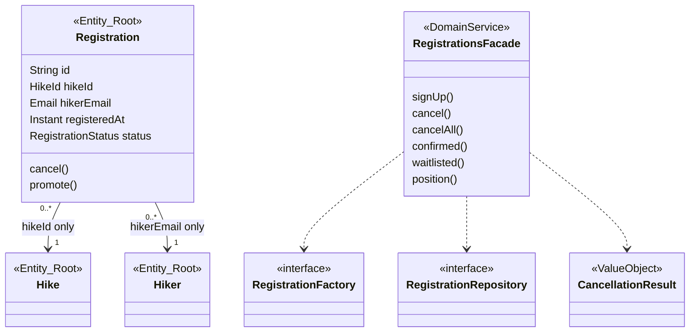
```mermaid
classDiagram
    class Registration {
        <<Entity_Root>>
        String id
        HikeId hikeId
        Email hikerEmail
        Instant registeredAt
        RegistrationStatus status
        cancel()
        promote()
    }
    class Hike { <<Entity_Root>> }
    class Hiker { <<Entity_Root>> }
    class CancellationResult { <<ValueObject>> }
    class RegistrationsFacade {
        <<DomainService>>
        signUp()
        cancel()
        cancelAll()
        confirmed()
        waitlisted()
        position()
    }
    class RegistrationFactory { <<interface>> }
    class RegistrationRepository { <<interface>> }
    Registration "0..*" --> "1" Hike : hikeId only
    Registration "0..*" --> "1" Hiker : hikerEmail only
    RegistrationsFacade ..> RegistrationFactory
    RegistrationsFacade ..> RegistrationRepository
    RegistrationsFacade ..> CancellationResult
```

### Sentiers

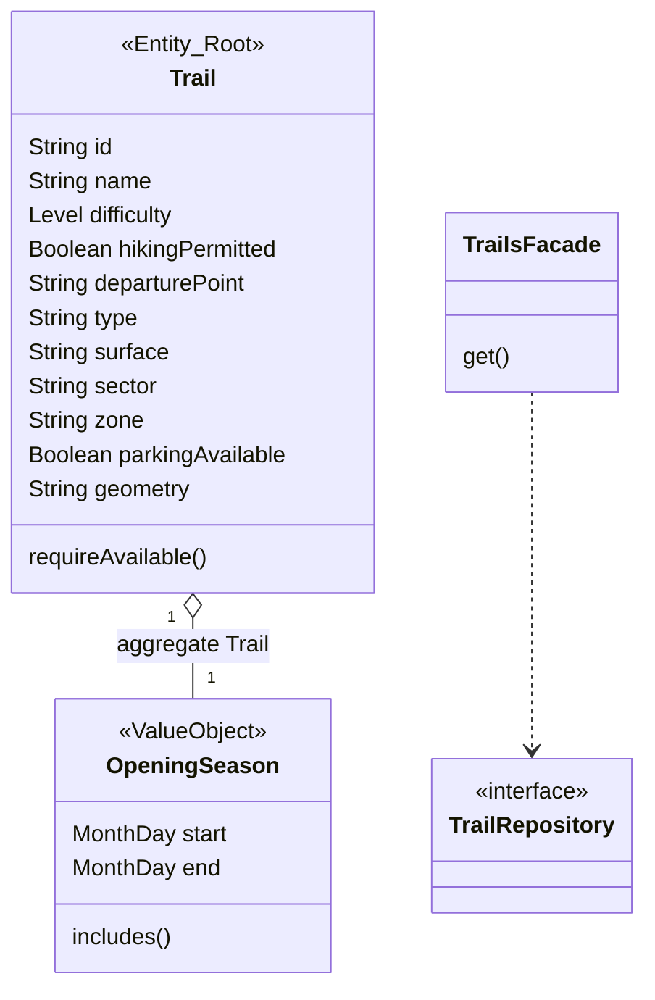
```mermaid
classDiagram
    class Trail {
        <<Entity_Root>>
        String id
        String name
        Level difficulty
        Boolean hikingPermitted
        String departurePoint
        String type
        String surface
        String sector
        String zone
        Boolean parkingAvailable
        String geometry
        requireAvailable()
    }
    class OpeningSeason {
        <<ValueObject>>
        MonthDay start
        MonthDay end
        includes()
    }
    class TrailsFacade { get() }
    class TrailRepository { <<interface>> }
    Trail "1" o-- "1" OpeningSeason : aggregate Trail
    TrailsFacade ..> TrailRepository
```

### Notifications

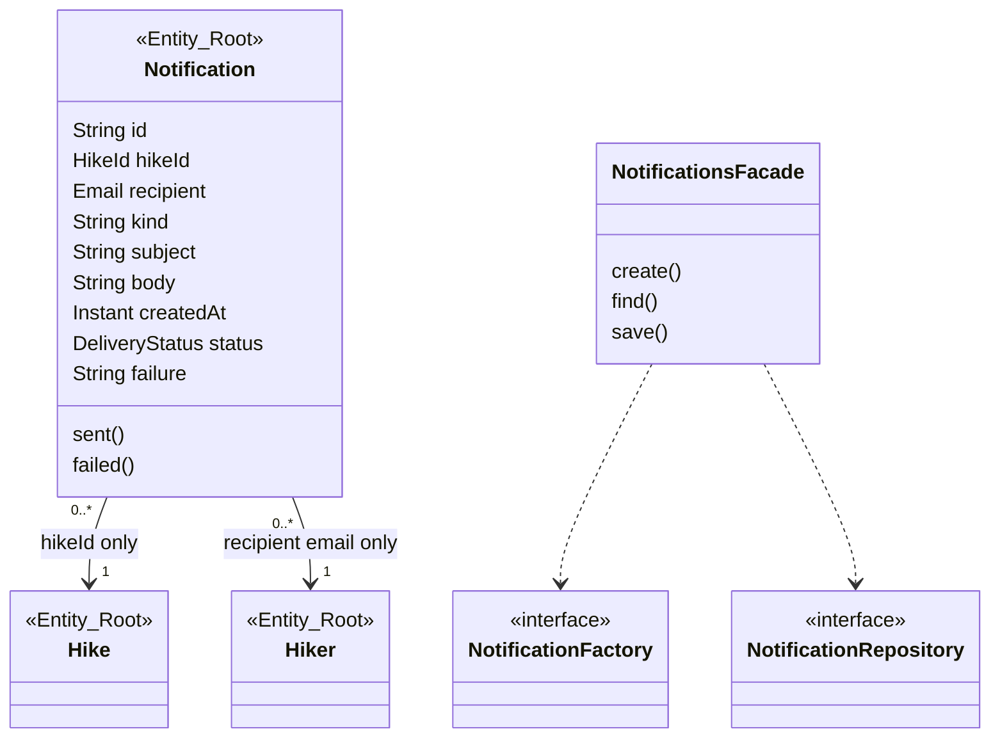
```mermaid
classDiagram
    class Notification {
        <<Entity_Root>>
        String id
        HikeId hikeId
        Email recipient
        String kind
        String subject
        String body
        Instant createdAt
        DeliveryStatus status
        String failure
        sent()
        failed()
    }
    class Hike { <<Entity_Root>> }
    class Hiker { <<Entity_Root>> }
    class NotificationsFacade {
        create()
        find()
        save()
    }
    class NotificationFactory { <<interface>> }
    class NotificationRepository { <<interface>> }
    Notification "0..*" --> "1" Hike : hikeId only
    Notification "0..*" --> "1" Hiker : recipient email only
    NotificationsFacade ..> NotificationFactory
    NotificationsFacade ..> NotificationRepository
```

### Authentification et autorisation

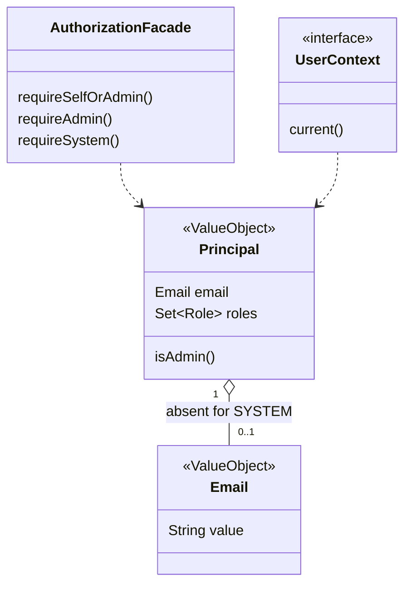
```mermaid
classDiagram
    class Principal {
        <<ValueObject>>
        Email email
        Set~Role~ roles
        isAdmin()
    }
    class Email {
        <<ValueObject>>
        String value
    }
    class AuthorizationFacade {
        requireSelfOrAdmin()
        requireAdmin()
        requireSystem()
    }
    class UserContext {
        <<interface>>
        current()
    }
    Principal "1" o-- "0..1" Email : absent for SYSTEM
    AuthorizationFacade ..> Principal
    UserContext ..> Principal
```

### Rapports d’utilisation des sentiers

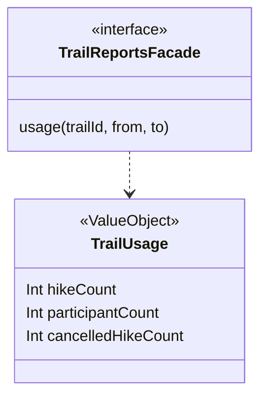
```mermaid
classDiagram
    class TrailUsage {
        <<ValueObject>>
        Int hikeCount
        Int participantCount
        Int cancelledHikeCount
    }
    class TrailReportsFacade {
        <<interface>>
        usage(trailId, from, to)
    }
    TrailReportsFacade ..> TrailUsage
```

## Réalisation des cas d'utilisation

### CU-01 - Parcourir les randonnées

#### Niveau 1

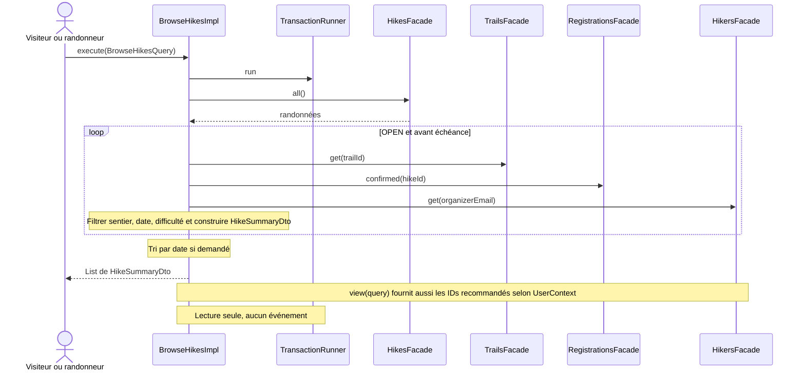
```mermaid
sequenceDiagram
    actor U as Visiteur ou randonneur
    participant UC as BrowseHikesImpl
    participant TX as TransactionRunner
    participant H as HikesFacade
    participant T as TrailsFacade
    participant R as RegistrationsFacade
    participant P as HikersFacade
    U->>UC: execute(BrowseHikesQuery)
    UC->>TX: run
    UC->>H: all()
    H-->>UC: randonnées
    loop OPEN et avant échéance
        UC->>T: get(trailId)
        UC->>R: confirmed(hikeId)
        UC->>P: get(organizerEmail)
        Note over UC: Filtrer sentier, date, difficulté et construire HikeSummaryDto
    end
    Note over UC: Tri par date si demandé
    UC-->>U: List de HikeSummaryDto
    Note over UC,P: view(query) fournit aussi les IDs recommandés selon UserContext
    Note over UC,TX: Lecture seule, aucun événement
```

#### Niveau 2

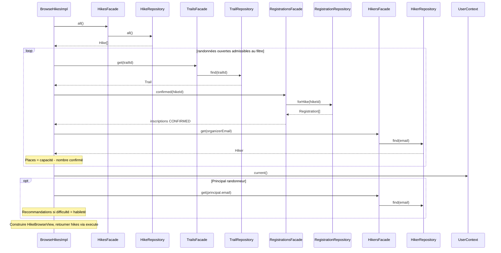
```mermaid
sequenceDiagram
    participant UC as BrowseHikesImpl
    participant HF as HikesFacade
    participant HR as HikeRepository
    participant TF as TrailsFacade
    participant TR as TrailRepository
    participant RF as RegistrationsFacade
    participant RR as RegistrationRepository
    participant PF as HikersFacade
    participant PR as HikerRepository
    participant C as UserContext
    UC->>HF: all()
    HF->>HR: all()
    HR-->>UC: Hike[]
    loop randonnées ouvertes admissibles au filtre
        UC->>TF: get(trailId)
        TF->>TR: find(trailId)
        TR-->>UC: Trail
        UC->>RF: confirmed(hikeId)
        RF->>RR: forHike(hikeId)
        RR-->>RF: Registration[]
        RF-->>UC: inscriptions CONFIRMED
        UC->>PF: get(organizerEmail)
        PF->>PR: find(email)
        PR-->>UC: Hiker
        Note over UC: Places = capacité - nombre confirmé
    end
    UC->>C: current()
    opt Principal randonneur
        UC->>PF: get(principal.email)
        PF->>PR: find(email)
        Note over UC: Recommandations si difficulté = habileté
    end
    Note over UC: Construire HikeBrowseView, retourner hikes via execute
```

### CU-02 - Enregistrer un randonneur

#### Niveau 1

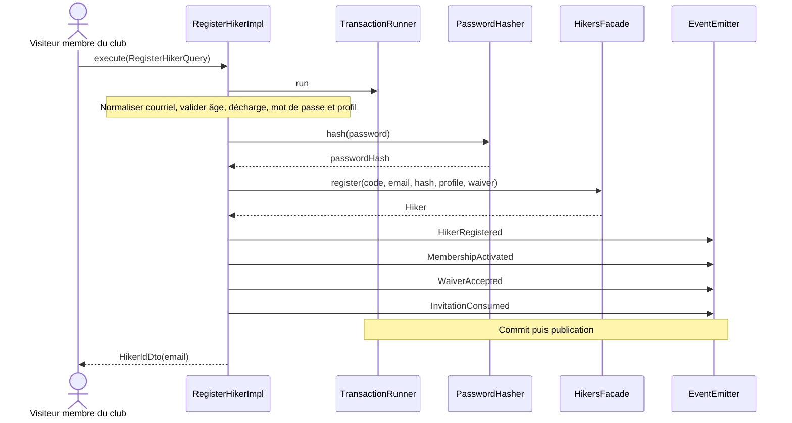
```mermaid
sequenceDiagram
    actor U as Visiteur membre du club
    participant UC as RegisterHikerImpl
    participant TX as TransactionRunner
    participant PW as PasswordHasher
    participant F as HikersFacade
    participant E as EventEmitter
    U->>UC: execute(RegisterHikerQuery)
    UC->>TX: run
    Note over UC: Normaliser courriel, valider âge, décharge, mot de passe et profil
    UC->>PW: hash(password)
    PW-->>UC: passwordHash
    UC->>F: register(code, email, hash, profile, waiver)
    F-->>UC: Hiker
    UC->>E: HikerRegistered
    UC->>E: MembershipActivated
    UC->>E: WaiverAccepted
    UC->>E: InvitationConsumed
    Note over TX,E: Commit puis publication
    UC-->>U: HikerIdDto(email)
```

#### Niveau 2

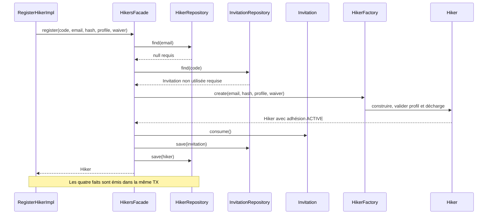
```mermaid
sequenceDiagram
    participant UC as RegisterHikerImpl
    participant F as HikersFacade
    participant PR as HikerRepository
    participant IR as InvitationRepository
    participant I as Invitation
    participant Factory as HikerFactory
    participant H as Hiker
    UC->>F: register(code, email, hash, profile, waiver)
    F->>PR: find(email)
    PR-->>F: null requis
    F->>IR: find(code)
    IR-->>F: Invitation non utilisée requise
    F->>Factory: create(email, hash, profile, waiver)
    Factory->>H: construire, valider profil et décharge
    H-->>F: Hiker avec adhésion ACTIVE
    F->>I: consume()
    F->>IR: save(invitation)
    F->>PR: save(hiker)
    F-->>UC: Hiker
    Note over UC,PR: Les quatre faits sont émis dans la même TX
```

### CU-05 - S’inscrire à une randonnée

#### Niveau 1

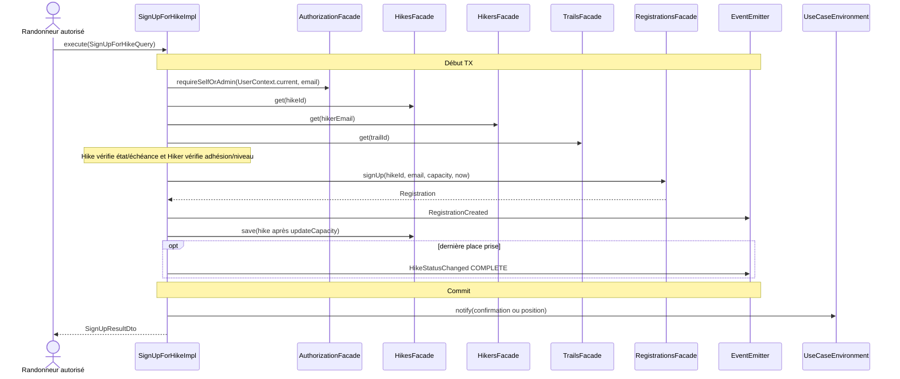
```mermaid
sequenceDiagram
    actor U as Randonneur autorisé
    participant UC as SignUpForHikeImpl
    participant A as AuthorizationFacade
    participant H as HikesFacade
    participant P as HikersFacade
    participant T as TrailsFacade
    participant R as RegistrationsFacade
    participant E as EventEmitter
    participant N as UseCaseEnvironment
    U->>UC: execute(SignUpForHikeQuery)
    Note over UC,E: Début TX
    UC->>A: requireSelfOrAdmin(UserContext.current, email)
    UC->>H: get(hikeId)
    UC->>P: get(hikerEmail)
    UC->>T: get(trailId)
    Note over UC: Hike vérifie état/échéance et Hiker vérifie adhésion/niveau
    UC->>R: signUp(hikeId, email, capacity, now)
    R-->>UC: Registration
    UC->>E: RegistrationCreated
    UC->>H: save(hike après updateCapacity)
    opt dernière place prise
        UC->>E: HikeStatusChanged COMPLETE
    end
    Note over UC,E: Commit
    UC->>N: notify(confirmation ou position)
    UC-->>U: SignUpResultDto
```

#### Niveau 2

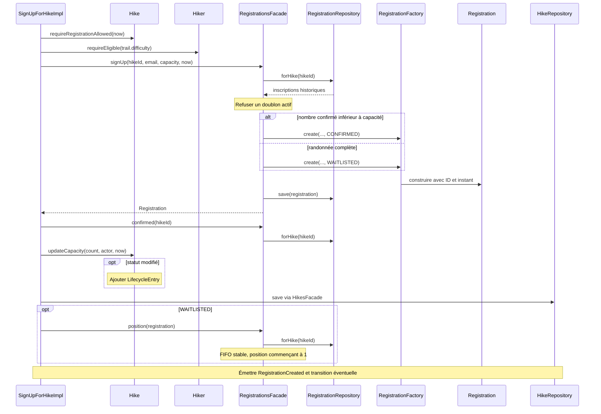
```mermaid
sequenceDiagram
    participant UC as SignUpForHikeImpl
    participant H as Hike
    participant P as Hiker
    participant F as RegistrationsFacade
    participant Repo as RegistrationRepository
    participant Factory as RegistrationFactory
    participant R as Registration
    participant HR as HikeRepository
    UC->>H: requireRegistrationAllowed(now)
    UC->>P: requireEligible(trail.difficulty)
    UC->>F: signUp(hikeId, email, capacity, now)
    F->>Repo: forHike(hikeId)
    Repo-->>F: inscriptions historiques
    Note over F: Refuser un doublon actif
    alt nombre confirmé inférieur à capacité
        F->>Factory: create(..., CONFIRMED)
    else randonnée complète
        F->>Factory: create(..., WAITLISTED)
    end
    Factory->>R: construire avec ID et instant
    F->>Repo: save(registration)
    F-->>UC: Registration
    UC->>F: confirmed(hikeId)
    F->>Repo: forHike(hikeId)
    UC->>H: updateCapacity(count, actor, now)
    opt statut modifié
        Note over H: Ajouter LifecycleEntry
    end
    UC->>HR: save via HikesFacade
    opt WAITLISTED
        UC->>F: position(registration)
        F->>Repo: forHike(hikeId)
        Note over F: FIFO stable, position commençant à 1
    end
    Note over UC,HR: Émettre RegistrationCreated et transition éventuelle
```

### CU-06 - Annuler une inscription

#### Niveau 1

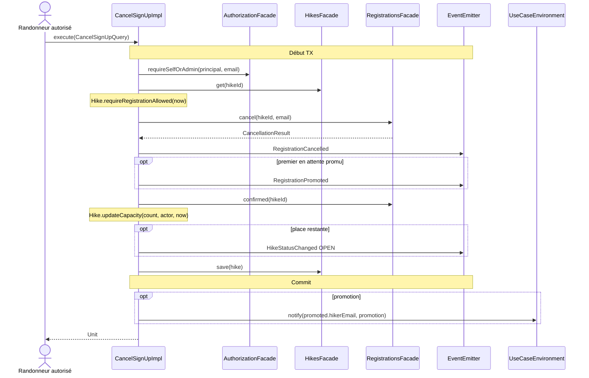
```mermaid
sequenceDiagram
    actor U as Randonneur autorisé
    participant UC as CancelSignUpImpl
    participant A as AuthorizationFacade
    participant H as HikesFacade
    participant R as RegistrationsFacade
    participant E as EventEmitter
    participant N as UseCaseEnvironment
    U->>UC: execute(CancelSignUpQuery)
    Note over UC,E: Début TX
    UC->>A: requireSelfOrAdmin(principal, email)
    UC->>H: get(hikeId)
    Note over UC: Hike.requireRegistrationAllowed(now)
    UC->>R: cancel(hikeId, email)
    R-->>UC: CancellationResult
    UC->>E: RegistrationCancelled
    opt premier en attente promu
        UC->>E: RegistrationPromoted
    end
    UC->>R: confirmed(hikeId)
    Note over UC: Hike.updateCapacity(count, actor, now)
    opt place restante
        UC->>E: HikeStatusChanged OPEN
    end
    UC->>H: save(hike)
    Note over UC,E: Commit
    opt promotion
        UC->>N: notify(promoted.hikerEmail, promotion)
    end
    UC-->>U: Unit
```

#### Niveau 2

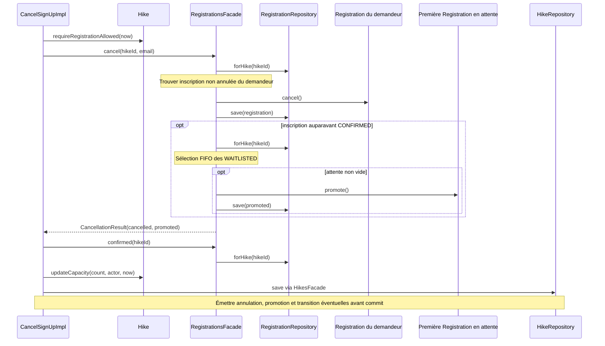
```mermaid
sequenceDiagram
    participant UC as CancelSignUpImpl
    participant H as Hike
    participant F as RegistrationsFacade
    participant Repo as RegistrationRepository
    participant R as Registration du demandeur
    participant W as Première Registration en attente
    participant HR as HikeRepository
    UC->>H: requireRegistrationAllowed(now)
    UC->>F: cancel(hikeId, email)
    F->>Repo: forHike(hikeId)
    Note over F: Trouver inscription non annulée du demandeur
    F->>R: cancel()
    F->>Repo: save(registration)
    opt inscription auparavant CONFIRMED
        F->>Repo: forHike(hikeId)
        Note over F: Sélection FIFO des WAITLISTED
        opt attente non vide
            F->>W: promote()
            F->>Repo: save(promoted)
        end
    end
    F-->>UC: CancellationResult(cancelled, promoted)
    UC->>F: confirmed(hikeId)
    F->>Repo: forHike(hikeId)
    UC->>H: updateCapacity(count, actor, now)
    UC->>HR: save via HikesFacade
    Note over UC,HR: Émettre annulation, promotion et transition éventuelles avant commit
```

### CU-07 - Mettre à jour un randonneur

#### Niveau 1

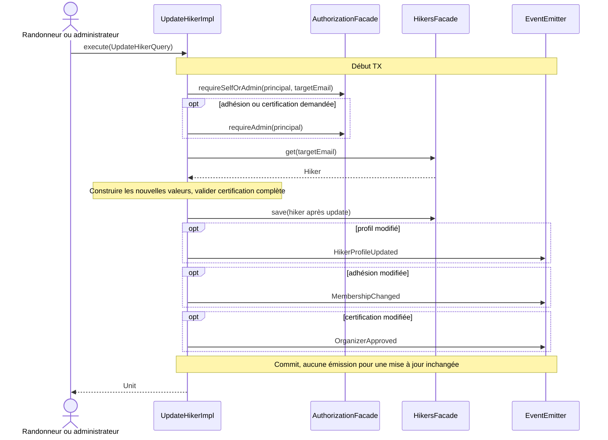
```mermaid
sequenceDiagram
    actor U as Randonneur ou administrateur
    participant UC as UpdateHikerImpl
    participant A as AuthorizationFacade
    participant F as HikersFacade
    participant E as EventEmitter
    U->>UC: execute(UpdateHikerQuery)
    Note over UC,E: Début TX
    UC->>A: requireSelfOrAdmin(principal, targetEmail)
    opt adhésion ou certification demandée
        UC->>A: requireAdmin(principal)
    end
    UC->>F: get(targetEmail)
    F-->>UC: Hiker
    Note over UC: Construire les nouvelles valeurs, valider certification complète
    UC->>F: save(hiker après update)
    opt profil modifié
        UC->>E: HikerProfileUpdated
    end
    opt adhésion modifiée
        UC->>E: MembershipChanged
    end
    opt certification modifiée
        UC->>E: OrganizerApproved
    end
    Note over UC,E: Commit, aucune émission pour une mise à jour inchangée
    UC-->>U: Unit
```

#### Niveau 2

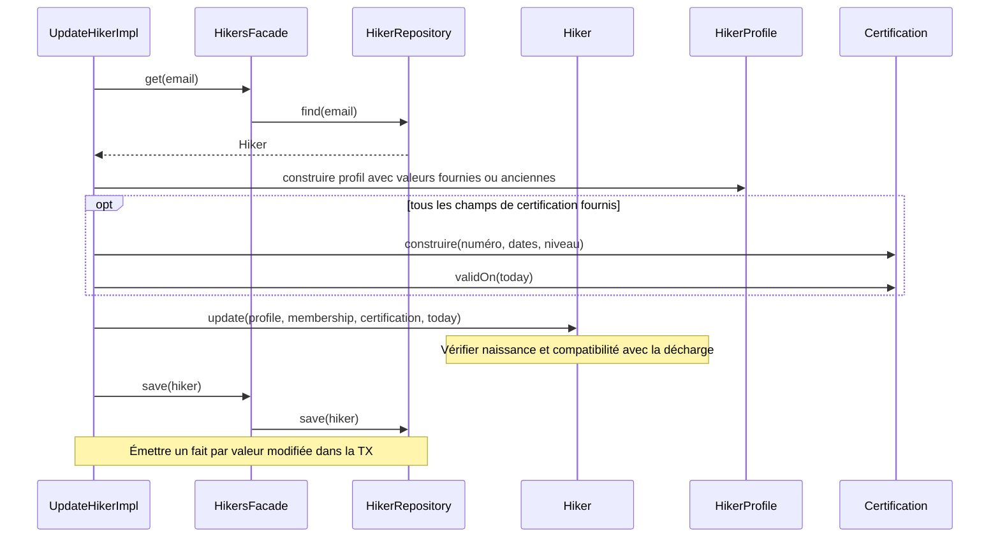
```mermaid
sequenceDiagram
    participant UC as UpdateHikerImpl
    participant F as HikersFacade
    participant Repo as HikerRepository
    participant H as Hiker
    participant P as HikerProfile
    participant C as Certification
    UC->>F: get(email)
    F->>Repo: find(email)
    Repo-->>UC: Hiker
    UC->>P: construire profil avec valeurs fournies ou anciennes
    opt tous les champs de certification fournis
        UC->>C: construire(numéro, dates, niveau)
        UC->>C: validOn(today)
    end
    UC->>H: update(profile, membership, certification, today)
    Note over H: Vérifier naissance et compatibilité avec la décharge
    UC->>F: save(hiker)
    F->>Repo: save(hiker)
    Note over UC,Repo: Émettre un fait par valeur modifiée dans la TX
```

### CU-08 - Fermer une randonnée

#### Niveau 1

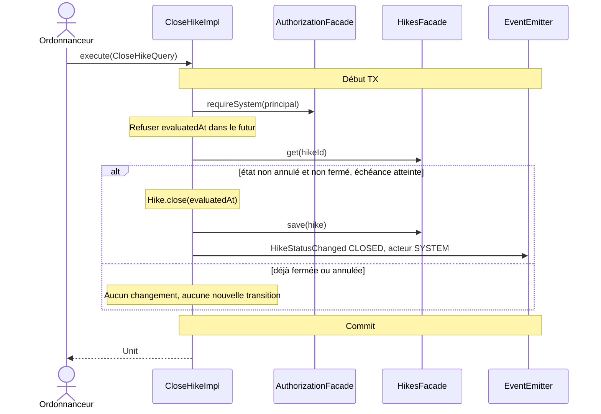
```mermaid
sequenceDiagram
    actor S as Ordonnanceur
    participant UC as CloseHikeImpl
    participant A as AuthorizationFacade
    participant H as HikesFacade
    participant E as EventEmitter
    S->>UC: execute(CloseHikeQuery)
    Note over UC,E: Début TX
    UC->>A: requireSystem(principal)
    Note over UC: Refuser evaluatedAt dans le futur
    UC->>H: get(hikeId)
    alt état non annulé et non fermé, échéance atteinte
        Note over UC: Hike.close(evaluatedAt)
        UC->>H: save(hike)
        UC->>E: HikeStatusChanged CLOSED, acteur SYSTEM
    else déjà fermée ou annulée
        Note over UC: Aucun changement, aucune nouvelle transition
    end
    Note over UC,E: Commit
    UC-->>S: Unit
```

#### Niveau 2

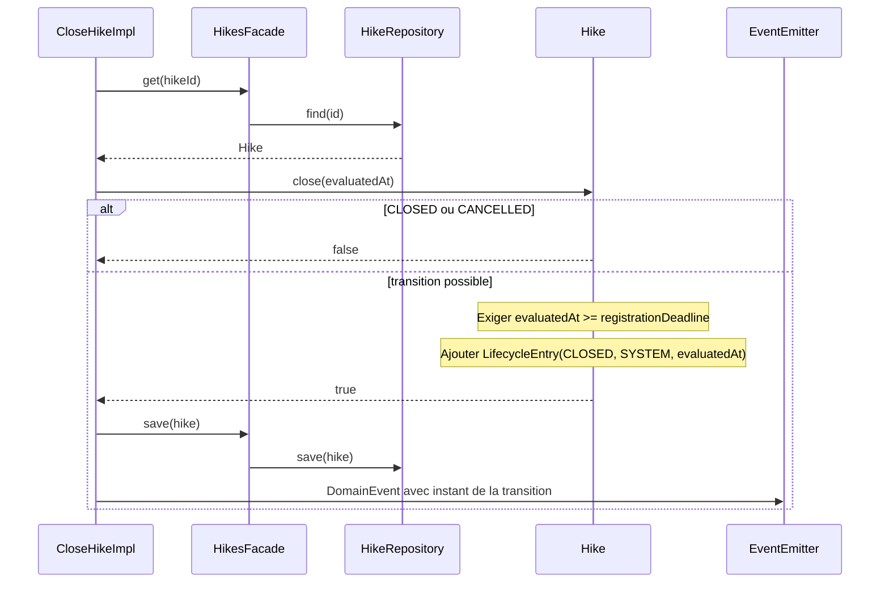
```mermaid
sequenceDiagram
    participant UC as CloseHikeImpl
    participant F as HikesFacade
    participant Repo as HikeRepository
    participant H as Hike
    participant E as EventEmitter
    UC->>F: get(hikeId)
    F->>Repo: find(id)
    Repo-->>UC: Hike
    UC->>H: close(evaluatedAt)
    alt CLOSED ou CANCELLED
        H-->>UC: false
    else transition possible
        Note over H: Exiger evaluatedAt >= registrationDeadline
        Note over H: Ajouter LifecycleEntry(CLOSED, SYSTEM, evaluatedAt)
        H-->>UC: true
        UC->>F: save(hike)
        F->>Repo: save(hike)
        UC->>E: DomainEvent avec instant de la transition
    end
```

### CU-09 - Envoyer un rappel

#### Niveau 1

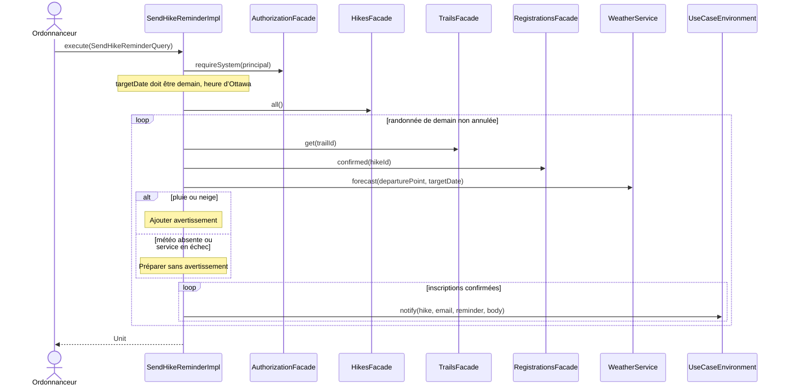
```mermaid
sequenceDiagram
    actor S as Ordonnanceur
    participant UC as SendHikeReminderImpl
    participant A as AuthorizationFacade
    participant H as HikesFacade
    participant T as TrailsFacade
    participant R as RegistrationsFacade
    participant W as WeatherService
    participant N as UseCaseEnvironment
    S->>UC: execute(SendHikeReminderQuery)
    UC->>A: requireSystem(principal)
    Note over UC: targetDate doit être demain, heure d’Ottawa
    UC->>H: all()
    loop randonnée de demain non annulée
        UC->>T: get(trailId)
        UC->>R: confirmed(hikeId)
        UC->>W: forecast(departurePoint, targetDate)
        alt pluie ou neige
            Note over UC: Ajouter avertissement
        else météo absente ou service en échec
            Note over UC: Préparer sans avertissement
        end
        loop inscriptions confirmées
            UC->>N: notify(hike, email, reminder, body)
        end
    end
    UC-->>S: Unit
```

#### Niveau 2

```mermaid
sequenceDiagram
    participant UC as SendHikeReminderImpl
    participant HR as HikeRepository
    participant TR as TrailRepository
    participant RR as RegistrationRepository
    participant N as NotificationsFacade
    participant NR as NotificationRepository
    participant NF as NotificationFactory
    participant Mail as EmailService
    participant E as EventEmitter
    UC->>HR: all via HikesFacade
    loop demain et non annulée
        UC->>TR: find(trailId) via TrailsFacade
        UC->>RR: forHike(hikeId) via RegistrationsFacade
        Note over UC: Filtrer CONFIRMED et construire date, heure, sentier, départ, météo
        loop destinataires confirmés
            UC->>N: find(hikeId, recipient, reminder)
            N->>NR: find(...)
            alt notification déjà SENT
                Note over UC: Ignorer, pas de nouvel envoi
            else absente ou FAILED
                opt absente
                    UC->>N: create(...)
                    N->>NF: create(...)
                    NF-->>N: Notification PENDING
                    N->>NR: save(notification)
                    UC->>E: NotificationRequested
                end
                Note over UC,NR: Commit de la demande avant transport
                UC->>Mail: send(notification)
                alt transport réussi
                    Note over UC: Notification.sent()
                    UC->>N: save(notification)
                    N->>NR: save(notification)
                    UC->>E: NotificationSent
                else échec
                    Note over UC: Notification.failed(message générique)
                    UC->>N: save(notification)
                    N->>NR: save(notification)
                    UC->>E: NotificationFailed
                end
            end
        end
    end
```

Les appels de livraison sont centralisés dans `UseCaseEnvironment.notify`, partagé avec les confirmations, promotions et annulations. L’échec du transport est capturé ; l’échec d’une persistance reste une erreur à traiter par le futur adaptateur.

### CU-10 - Créer une randonnée

#### Niveau 1

```mermaid
sequenceDiagram
    actor U as Organisateur
    participant UC as CreateHikeImpl
    participant C as UserContext
    participant T as TrailsFacade
    participant P as HikersFacade
    participant H as HikesFacade
    participant E as EventEmitter
    U->>UC: execute(CreateHikeQuery)
    Note over UC,E: Début TX
    UC->>C: current()
    Note over UC: Identité authentifiée = organizerEmail
    UC->>T: get(trailId)
    UC->>P: get(organizerEmail)
    Note over UC: Sentier autorisé, saison, certification et niveau
    UC->>H: create(organizer, details, now)
    H-->>UC: Hike
    UC->>E: HikeCreated
    UC->>E: HikeStatusChanged OPEN
    Note over UC,E: Commit
    UC-->>U: HikeIdDto
```

#### Niveau 2

```mermaid
sequenceDiagram
    participant UC as CreateHikeImpl
    participant TF as TrailsFacade
    participant TR as TrailRepository
    participant T as Trail
    participant PF as HikersFacade
    participant PR as HikerRepository
    participant P as Hiker
    participant HF as HikesFacade
    participant Factory as HikeFactory
    participant H as Hike
    participant Repo as HikeRepository
    UC->>TF: get(trailId)
    TF->>TR: find(trailId)
    TR-->>UC: Trail
    UC->>T: requireAvailable(date)
    UC->>PF: get(email)
    PF->>PR: find(email)
    PR-->>UC: Hiker
    UC->>P: requireOrganizer(date, difficulty)
    Note over UC: Construire HikeDetails, vérifier capacité et échéance
    UC->>HF: create(organizer, details, now)
    Note over HF: Départ et échéance futurs
    HF->>Factory: create(organizer, details, now)
    Factory->>H: construire avec identifiant unique
    Note over H: Première LifecycleEntry OPEN avec le créateur
    HF->>Repo: save(hike)
    HF-->>UC: Hike
    Note over UC,Repo: Émettre création et transition OPEN avant commit
```

### CU-11 - Annuler une randonnée

#### Niveau 1

```mermaid
sequenceDiagram
    actor U as Organisateur ou administrateur
    participant UC as CancelHikeImpl
    participant C as UserContext
    participant H as HikesFacade
    participant R as RegistrationsFacade
    participant E as EventEmitter
    participant N as UseCaseEnvironment
    U->>UC: execute(CancelHikeQuery)
    Note over UC,E: Début TX
    UC->>C: current()
    UC->>H: get(hikeId)
    Note over UC: Vérifier identité, propriétaire ou administrateur, motif et début futur
    alt pas encore annulée
        UC->>R: cancelAll(hikeId)
        R-->>UC: inscriptions affectées
        UC->>H: save(hike après cancel)
        UC->>E: HikeStatusChanged CANCELLED
        loop inscriptions affectées
            UC->>E: RegistrationCancelled
        end
    else déjà annulée
        Note over UC: Aucune nouvelle modification ni notification
    end
    Note over UC,E: Commit
    loop inscriptions affectées
        UC->>N: notify(recipient, hike-cancelled, motif)
    end
    UC-->>U: Unit
```

#### Niveau 2

```mermaid
sequenceDiagram
    participant UC as CancelHikeImpl
    participant HF as HikesFacade
    participant HR as HikeRepository
    participant H as Hike
    participant RF as RegistrationsFacade
    participant RR as RegistrationRepository
    participant R as Registration
    participant E as EventEmitter
    UC->>HF: get(hikeId)
    HF->>HR: find(id)
    HR-->>UC: Hike
    UC->>H: cancel(actor, reason, now)
    Note over H: Motif non vide et now strictement avant startsAt
    alt transition vers CANCELLED
        Note over H: Ajouter LifecycleEntry avec motif
        UC->>RF: cancelAll(hikeId)
        RF->>RR: forHike(hikeId)
        loop inscriptions CONFIRMED ou WAITLISTED
            RF->>R: cancel()
            RF->>RR: save(registration)
        end
        RF-->>UC: inscriptions affectées
        UC->>HF: save(hike)
        HF->>HR: save(hike)
        UC->>E: HikeStatusChanged
        loop inscriptions affectées
            UC->>E: RegistrationCancelled
        end
    else déjà CANCELLED avant départ
        H-->>UC: false
    end
    Note over UC,E: Commit avant toute livraison de courriel
```

## Déclaration d'utilisation de l'IA générative

Aucun outil d’intelligence artificielle générative n’a été utilisé pour ce livrable.